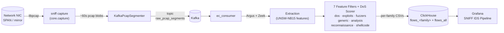

# realtime-packet-sniff 🛰️

> Real-time packet capture, decoding, and IDS pipeline for Linux.
>
> *Công cụ bắt gói tin thời gian thực kèm pipeline phát hiện tấn công mạng — dự án NCKH.*

[](LICENSE)
[](https://www.python.org/)
[]()
[](tests/integration_tests/)
[]()

📖 [Đọc bằng Tiếng Việt](README_VI.md)

SNIFF is a real-time packet capture tool with an interactive TUI, a background
daemon, and a live NDJSON stream mode. The same capture engine is the
front-end of a full IDS pipeline that streams pcap segments to Kafka,
extracts per-flow features with Argus + Zeek, classifies them against the
UNSW-NB15 attack taxonomy with seven per-family feature filters and a rule-based DoS scoring engine, and ships
results to ClickHouse for visualisation in Grafana.

## Architecture



Each Kafka message is a self-describing pcap segment (≈60 s of traffic)
tagged with a UUID `segment_id`. Re-processing the same segment is
idempotent: ClickHouse `ReplacingMergeTree` deduplicates by
`(segment_id, srcip, dstip, sport, dport, proto, ts)`.

## Features

**Capture tool**

- Live interactive TUI with packet list, protocol stats, and top flows.
- Background daemon with PID/log file management and `SIGTERM`/`SIGHUP`/`SIGUSR1`/`SIGUSR2` signal handling.
- `--live` NDJSON stream to stdout — pipe into `jq`, `head`, or anything else.
- Scapy `AsyncSniffer` + libpcap backend, lock-free ring buffer, two-tier decode (cheap L2–L4 hot path, opt-in L7 deep decode).
- BPF kernel-side filter + post-decode Wireshark-style display filter.
- Rotating pcap writer (interval and size based) with retention cleanup.
- Per-protocol counters and 5-tuple conversation tracking.

**IDS pipeline**

- Kafka KRaft producer with ~60 s pcap blobs and 64 MiB back-pressure.
- Argus + Zeek feature extraction producing the 45-column UNSW-NB15 feature set.
- Seven per-family feature filters (UNSW-NB15 attack taxonomy): `dos`, `exploits`, `fuzzers`, `generic`, `analysis`, `reconnaissance`, `shellcode`. DoS flows are further analysed by a dedicated rule-based scoring engine (`dos_classifier.py`) with three specialised sub-type scorers (SYN Flood · UDP Flood · ICMP Flood).
- ClickHouse sink with batched inserts, ReplacingMergeTree dedup, audit columns (`segment_id`, `attack_family`, `attack_subtype`, `is_attack`, `interface`, `t_window`, `pcap_file`).
- `pipeline_runs` audit table — one row per consumed segment, with duration and error message.
- Grafana dashboard "SNIFF IDS Pipeline" with attacks timeline, top attackers, family counts, and pipeline health.
- systemd units for `kafka`, `sniff-producer`, `ec-consumer`.

## Quick Start

### One-line install (recommended)

```bash
curl -fsSL https://raw.githubusercontent.com/ntu168108/realtime-packet-sniff/main/install.sh -o /tmp/install.sh && sudo bash /tmp/install.sh --verbose
```

The installer checks for Python 3.8+, libpcap, and disk space, then installs
`scapy` and the `sniff` command. Pass `--skip-systemd` to skip the optional
daemon unit setup.

### Basic usage

```bash
sudo sniff                              # Interactive menu (lists interfaces)
sudo sniff -i eth0                      # Quick capture on eth0
sudo sniff -i eth0 --live | jq .        # Live NDJSON stream
sudo sniff -i eth0 -f "tcp port 443"    # BPF filter (kernel-side)
sudo sniff --help                       # Full CLI reference
sudo sniff --list-interfaces            # Show available interfaces
sudo sniff --list-protocols             # Show supported protocols
sudo sniff --status                     # Daemon status
sudo sniff --stop                       # Stop daemon gracefully
```

### From source

```bash
git clone https://github.com/ntu168108/realtime-packet-sniff.git
cd realtime-packet-sniff
pip install --break-system-packages .
sudo sniff -i eth0
```

## CLI reference

The thin entry point `sniff.py` exposes the most useful flags (full list via
`sudo sniff --help`):

| Flag | Purpose |
|------|---------|
| `-i`, `--interface` | Network interface to capture on |
| `-f`, `--filter` | BPF filter (kernel-side, e.g. `"tcp port 80"`) |
| `-s`, `--snaplen` | Capture length per packet (default `65535`) |
| `-b`, `--buffer` | Buffer profile: `low`, `balanced`, `fast`, `max` |
| `-p`, `--no-promisc` | Disable promiscuous mode |
| `-o`, `--output` | Output directory (default `./sniff_data`) |
| `-r`, `--retention` | Days to keep files (default `7`) |
| `--rotate-interval` | Rotation interval, suffix `s/m/h/d` (default `3600`) |
| `--rotate-size` | Rotate when file exceeds size in MB (default `500`) |
| `--no-rotate` | Single-file capture (no rotation) |
| `--live` | Stream NDJSON to stdout (no TUI) |
| `--display-filter` | Post-decode display filter, Wireshark-style |
| `--count` | Stop after N packets (`0` = unlimited) |
| `--exclude-port` | Exclude a port (repeatable) |
| `-d`, `--daemon` | Run as background daemon |
| `--status` | Show daemon status |
| `--stop` | Stop the daemon (graceful then SIGKILL) |
| `--list-interfaces` | List available interfaces |
| `--list-protocols` | List supported L2–L7 protocols and exit |

## Display filter

`--display-filter` accepts a small Wireshark-style mini-language that runs
*after* decode (it does not replace the kernel BPF filter). It supports:

- `host <ip>`, `src host <ip>`, `dst host <ip>`
- `port <n>`, `src port <n>`, `dst port <n>`
- `tcp`, `udp`, `icmp`, `icmpv6`, `arp`, `igmp`, `ipv4`, `ipv6`,
  `dns`, `http`, `tls`, `quic`, `dhcp`, `ntp`
- Boolean operators: `and`, `or`, `not`, and parentheses

Examples:

```
--display-filter 'port 443'
--display-filter 'tcp and not (port 22 or port 80)'
--display-filter '(src host 10.0.0.5 or dst host 10.0.0.5) and dns'
```

## Full IDS pipeline (advanced)

The IDS pipeline that ships with this repo is the lab reference pipeline
used by the project authors — not part of the one-liner install.

> 📖 **Self-deployment guide (step-by-step):** [`DEPLOYMENT.md`](DEPLOYMENT.md)  
> Covers: Kafka, ClickHouse, Grafana, Argus, Zeek, systemd services, and troubleshooting.  
> 🇻🇳 Bản tiếng Việt: [`HUONG_DAN_TRIEN_KHAI.md`](HUONG_DAN_TRIEN_KHAI.md)

See [`docs/ARCHITECTURE.md`](docs/ARCHITECTURE.md) for the full data flow,
[`docs/OPERATIONS.md`](docs/OPERATIONS.md) for the operator runbook, and
the `deploy/` and `sql/` directories for ready-to-use configs.

**Attack families** (UNSW-NB15 taxonomy — feature filter per family, rule-based scoring for DoS):

`dos`, `exploits`, `fuzzers`, `generic`, `analysis`, `reconnaissance`, `shellcode`

**Required services** for the full pipeline:

- Apache Kafka (KRaft mode)
- ClickHouse server
- Grafana (with the provisioned dashboard)
- Zeek and Argus for per-flow feature extraction
- Python deps from `requirements-integration.txt`:
  `kafka-python-ng`, `clickhouse-driver`, `pandas`, `numpy`, `pyyaml`

## Project structure

```text
.
├── sniff.py                 # Thin CLI entry point (argparse + dispatch)
├── install.sh               # One-line installer for the capture tool
├── setup.py                 # pip-installable package (`sniff` command)
├── requirements.txt         # Capture-only deps: scapy
├── requirements-integration.txt  # Pipeline deps: kafka, clickhouse, pandas, …
├── config.yaml.example      # Reference config for the capture tool
├── cli/                     # TUI app, daemon, menu, live NDJSON printer
├── core/                    # Capture engine, decoder, pcap writer, rotator
│                             # ring buffer, constants, display filter
├── ui/                      # Colours / TUI helpers
├── modules/                 # Pluggable analyzer modules
├── integration/             # Kafka producer/consumer, pcap segmenter,
│                             # ClickHouse sink, schema, config loader
├── Extraction-and-classification/
│   ├── MODULE_TRICHXUAT     # Argus + Zeek feature extraction
│   ├── MODULE_PHANLOAI      # 7 UNSW-NB15 per-family classifiers
│   └── MODULE_AUTO          # Orchestrator (auto_pipeline.py)
├── deploy/                  # Kafka properties, Grafana provisioning,
│                             # systemd unit files
├── sql/                     # ClickHouse DDL (7 flows_<family> + flows_all
│                             # + pipeline_runs)
├── docs/                    # ARCHITECTURE.md, OPERATIONS.md (runbook)
├── scripts/                 # install.sh, setup.sh, uninstall.sh, sniff.service
└── tests/integration_tests/ # 36 tests covering segmenter, sink, config, …
```

## Development

```bash
git clone https://github.com/ntu168108/realtime-packet-sniff.git
cd realtime-packet-sniff
python3 -m venv .venv && source .venv/bin/activate

# Capture tool deps (scapy)
pip install -r requirements.txt

# Pipeline deps (Kafka, ClickHouse, pandas, …)
pip install -r requirements-integration.txt

# Run the test suite
pytest -q
```

The integration tests cover the pcap segment round-trip, Kafka segmenter
behaviour, the ClickHouse sink type casters, config loading, idempotent
re-processing, and display filter parsing.

## Web GUI (sniff-web)

A web-based control panel runs as `sniff-web.service` on port 8000. It manages
the same capture engine the TUI uses, plus all 5 systemd services, Kafka topics,
ClickHouse queries, and rotated PCAP files — all from a browser.

> **v0.4.0:** changing the interface on `/capture` now also restarts the
> Kafka/ClickHouse pipeline (`sniff-producer`) so the UI and the backend
> classification pipeline always point at the same NIC. `/credentials`
> auto-detects the IP of the currently-captured interface (via
> `psutil.net_if_addrs`) when surfacing Grafana / ClickHouse / Kafka URLs.

See `sniff-web/docs/WEB_GUI.md` for full documentation. Quick start:

```bash
sudo bash sniff-web/scripts/install_web.sh
# Open http://<server>:8000 — login admin / sniff
```

## License

[MIT](LICENSE) — see the `LICENSE` file.

## Acknowledgements

- [UNSW-NB15 dataset](https://research.unsw.edu.au/projects/unsw-nb15-dataset)
  and its feature scheme, used by the per-family classifiers.
- [Argus](https://openargus.org/) and [Zeek](https://zeek.org/) for
  per-flow feature extraction.
- [Scapy](https://scapy.net/) for the libpcap capture backend.
- [Apache Kafka](https://kafka.apache.org/), [ClickHouse](https://clickhouse.com/),
  and [Grafana](https://grafana.com/) for the storage and observability stack.
