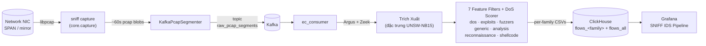

# realtime-packet-sniff 🛰️

> Công cụ bắt gói tin mạng thời gian thực kèm pipeline phát hiện tấn công cho Linux.
>
> *Real-time packet capture, decoding, and IDS pipeline for Linux.*

[](LICENSE)
[](https://www.python.org/)
[]()
[](tests/integration_tests/)
[]()

SNIFF là công cụ bắt gói tin mạng thời gian thực với giao diện TUI tương tác, daemon chạy nền, và chế độ stream NDJSON trực tiếp. Engine bắt gói tin này đồng thời là đầu vào cho một pipeline IDS hoàn chỉnh: stream các đoạn pcap lên Kafka, trích xuất đặc trưng per-flow bằng Argus + Zeek, phân loại theo taxonomy tấn công UNSW-NB15 với bảy bộ lọc đặc trưng per-family và một engine scoring DoS dựa trên luật, và lưu kết quả vào ClickHouse để trực quan hóa trên Grafana.

## Kiến Trúc



Mỗi message Kafka là một đoạn pcap tự mô tả (~60 giây traffic) được gắn UUID `segment_id`. Xử lý lại cùng một đoạn là idempotent: ClickHouse `ReplacingMergeTree` dedup theo `(segment_id, srcip, dstip, sport, dport, proto, ts)`.

## Tính Năng

**Công cụ bắt gói tin**

- TUI tương tác với danh sách gói tin, thống kê giao thức, và top flows.
- Daemon chạy nền với quản lý PID/log file và xử lý signal `SIGTERM`/`SIGHUP`/`SIGUSR1`/`SIGUSR2`.
- Chế độ `--live` stream NDJSON ra stdout — pipe vào `jq`, `head`, hoặc bất kỳ công cụ nào khác.
- Scapy `AsyncSniffer` + backend libpcap, lock-free ring buffer, two-tier decode (hot path L2–L4 nhanh, deep decode L7 tùy chọn).
- BPF filter phía kernel + display filter post-decode kiểu Wireshark.
- Pcap writer có rotation tự động (theo thời gian và kích thước) với dọn dẹp file cũ theo retention.
- Bộ đếm per-protocol và theo dõi conversation 5-tuple.

**Pipeline IDS**

- Kafka KRaft producer với pcap blob ~60 giây và back-pressure 64 MiB.
- Trích xuất đặc trưng bằng Argus + Zeek, tạo ra bộ đặc trưng 45 cột UNSW-NB15.
- Bảy bộ lọc đặc trưng per-family (họ tấn công UNSW-NB15): `dos`, `exploits`, `fuzzers`, `generic`, `analysis`, `reconnaissance`, `shellcode`. Luồng DoS còn được phân tích thêm bởi engine scoring dựa trên luật (`dos_classifier.py`) với ba bộ scoring chuyên biệt (SYN Flood · UDP Flood · ICMP Flood).
- ClickHouse sink với insert theo batch, dedup ReplacingMergeTree, các cột audit (`segment_id`, `attack_family`, `attack_subtype`, `is_attack`, `interface`, `t_window`, `pcap_file`).
- Bảng audit `pipeline_runs` — một dòng cho mỗi segment đã xử lý, kèm thời gian chạy và thông báo lỗi.
- Dashboard Grafana "SNIFF IDS Pipeline" với timeline tấn công, top attacker, số lượng per-family, và trạng thái pipeline.
- Unit systemd cho `kafka`, `sniff-producer`, `ec-consumer`.

## Bắt Đầu Nhanh

### Cài đặt một lệnh (khuyến nghị)

```bash
curl -fsSL https://raw.githubusercontent.com/ntu168108/realtime-packet-sniff/main/install.sh -o /tmp/install.sh && sudo bash /tmp/install.sh --verbose
```

Script tự động kiểm tra Python 3.8+, libpcap, và dung lượng đĩa, sau đó cài `scapy` và lệnh `sniff`. Truyền `--skip-systemd` để bỏ qua thiết lập daemon unit.

### Sử dụng cơ bản

```bash
sudo sniff                              # Menu tương tác (liệt kê interface)
sudo sniff -i eth0                      # Bắt gói tin trên eth0
sudo sniff -i eth0 --live | jq .        # Stream NDJSON trực tiếp
sudo sniff -i eth0 -f "tcp port 443"    # BPF filter (phía kernel)
sudo sniff --help                       # Tham khảo CLI đầy đủ
sudo sniff --list-interfaces            # Hiện các interface khả dụng
sudo sniff --list-protocols             # Hiện các giao thức được hỗ trợ
sudo sniff --status                     # Trạng thái daemon
sudo sniff --stop                       # Dừng daemon (graceful)
```

### Từ source

```bash
git clone https://github.com/ntu168108/realtime-packet-sniff.git
cd realtime-packet-sniff
pip install --break-system-packages .
sudo sniff -i eth0
```

## Tham Khảo CLI

Entry point mỏng `sniff.py` cung cấp các flag hữu ích nhất (xem đầy đủ qua `sudo sniff --help`):

| Flag | Mục đích |
|------|---------|
| `-i`, `--interface` | Network interface để bắt gói tin |
| `-f`, `--filter` | BPF filter (phía kernel, ví dụ `"tcp port 80"`) |
| `-s`, `--snaplen` | Độ dài bắt per-packet (mặc định `65535`) |
| `-b`, `--buffer` | Profile buffer: `low`, `balanced`, `fast`, `max` |
| `-p`, `--no-promisc` | Tắt chế độ promiscuous |
| `-o`, `--output` | Thư mục đầu ra (mặc định `./sniff_data`) |
| `-r`, `--retention` | Số ngày giữ file (mặc định `7`) |
| `--rotate-interval` | Khoảng thời gian rotation, hậu tố `s/m/h/d` (mặc định `3600`) |
| `--rotate-size` | Rotate khi file vượt quá kích thước MB (mặc định `500`) |
| `--no-rotate` | Bắt một file duy nhất (không rotation) |
| `--live` | Stream NDJSON ra stdout (không TUI) |
| `--display-filter` | Display filter post-decode, kiểu Wireshark |
| `--count` | Dừng sau N gói tin (`0` = không giới hạn) |
| `--exclude-port` | Loại trừ một port (có thể dùng nhiều lần) |
| `-d`, `--daemon` | Chạy dưới dạng daemon nền |
| `--status` | Hiện trạng thái daemon |
| `--stop` | Dừng daemon (graceful rồi SIGKILL) |
| `--list-interfaces` | Liệt kê các interface khả dụng |
| `--list-protocols` | Liệt kê các giao thức L2–L7 được hỗ trợ rồi thoát |

## Display Filter

`--display-filter` chấp nhận ngôn ngữ mini kiểu Wireshark chạy *sau khi* decode (không thay thế BPF filter phía kernel). Hỗ trợ:

- `host <ip>`, `src host <ip>`, `dst host <ip>`
- `port <n>`, `src port <n>`, `dst port <n>`
- `tcp`, `udp`, `icmp`, `icmpv6`, `arp`, `igmp`, `ipv4`, `ipv6`,
  `dns`, `http`, `tls`, `quic`, `dhcp`, `ntp`
- Toán tử logic: `and`, `or`, `not`, và dấu ngoặc đơn

Ví dụ:

```
--display-filter 'port 443'
--display-filter 'tcp and not (port 22 or port 80)'
--display-filter '(src host 10.0.0.5 or dst host 10.0.0.5) and dns'
```

## Pipeline IDS Đầy Đủ (Nâng Cao)

Pipeline IDS đi kèm repo là pipeline tham khảo của lab dự án — không phải một phần của cài đặt one-liner.

> 📖 **Hướng dẫn tự triển khai từng bước (tiếng Việt):** [`HUONG_DAN_TRIEN_KHAI.md`](HUONG_DAN_TRIEN_KHAI.md)  
> Bao gồm: cài Kafka, ClickHouse, Grafana, Argus, Zeek, systemd services, xử lý sự cố thường gặp.  
> 🇬🇧 English version: [`DEPLOYMENT.md`](DEPLOYMENT.md)

Xem [`docs/ARCHITECTURE.md`](docs/ARCHITECTURE.md) cho data flow đầy đủ, [`docs/OPERATIONS.md`](docs/OPERATIONS.md) cho runbook vận hành, và các thư mục `deploy/` và `sql/` cho config sẵn dùng.

**Các attack family** (taxonomy UNSW-NB15 — bộ lọc đặc trưng per family, scoring dựa trên luật cho DoS):

`dos`, `exploits`, `fuzzers`, `generic`, `analysis`, `reconnaissance`, `shellcode`

**Các service bắt buộc** cho pipeline đầy đủ:

- Apache Kafka (KRaft mode)
- ClickHouse server
- Grafana (với dashboard đã provisioned)
- Zeek và Argus để trích xuất đặc trưng per-flow
- Python deps từ `requirements-integration.txt`:
  `kafka-python-ng`, `clickhouse-driver`, `pandas`, `numpy`, `pyyaml`

## Cấu Trúc Dự Án

```text
.
├── sniff.py                 # Entry point CLI mỏng (argparse + dispatch)
├── install.sh               # Installer one-liner cho công cụ bắt gói tin
├── setup.py                 # Package pip-installable (lệnh `sniff`)
├── requirements.txt         # Deps bắt gói tin: scapy
├── requirements-integration.txt  # Deps pipeline: kafka, clickhouse, pandas, …
├── config.yaml.example      # Config tham khảo cho công cụ bắt gói tin
├── cli/                     # TUI app, daemon, menu, live NDJSON printer
├── core/                    # Engine bắt gói tin, decoder, pcap writer, rotator,
│                             # ring buffer, constants, display filter
├── ui/                      # Màu sắc / TUI helpers
├── modules/                 # Các module analyzer dạng plugin
├── integration/             # Kafka producer/consumer, pcap segmenter,
│                             # ClickHouse sink, schema, config loader
├── Extraction-and-classification/
│   ├── MODULE_TRICHXUAT     # Trích xuất đặc trưng bằng Argus + Zeek
│   ├── MODULE_PHANLOAI      # 7 per-family classifier UNSW-NB15
│   └── MODULE_AUTO          # Orchestrator (auto_pipeline.py)
├── deploy/                  # Kafka properties, Grafana provisioning,
│                             # systemd unit files
├── sql/                     # ClickHouse DDL (7 flows_<family> + flows_all
│                             # + pipeline_runs)
├── docs/                    # ARCHITECTURE.md, OPERATIONS.md (runbook)
├── scripts/                 # install.sh, setup.sh, uninstall.sh, sniff.service
└── tests/integration_tests/ # 36 test bao phủ segmenter, sink, config, …
```

## Phát Triển

```bash
git clone https://github.com/ntu168108/realtime-packet-sniff.git
cd realtime-packet-sniff
python3 -m venv .venv && source .venv/bin/activate

# Deps công cụ bắt gói tin (scapy)
pip install -r requirements.txt

# Deps pipeline (Kafka, ClickHouse, pandas, …)
pip install -r requirements-integration.txt

# Chạy test suite
pytest -q
```

Các integration test bao gồm round-trip pcap segment, hành vi Kafka segmenter, type caster ClickHouse sink, load config, xử lý lại idempotent, và parse display filter.

## Web GUI (sniff-web)

Giao diện web chạy như `sniff-web.service` trên port 8000. Quản lý capture engine
y hệt TUI, kèm 5 systemd services, Kafka topics, ClickHouse queries, và file PCAP
đã rotate — tất cả từ trình duyệt.

> **v0.4.0:** đổi interface trên `/capture` giờ cũng tự khởi động lại pipeline
> Kafka/ClickHouse (`sniff-producer`) để UI và pipeline phân loại backend luôn
> cùng trỏ vào một NIC. `/credentials` tự phát hiện IP của interface đang
> bắt gói tin (qua `psutil.net_if_addrs`) khi hiển thị URL Grafana /
> ClickHouse / Kafka.

Xem `sniff-web/docs/WEB_GUI.md` để biết chi tiết. Cài nhanh:

```bash
sudo bash sniff-web/scripts/install_web.sh
# Mở http://<server>:8000 — đăng nhập admin / sniff
```

## Giấy Phép

[MIT](LICENSE) — xem file `LICENSE`.

## Ghi Nhận

- [Dataset UNSW-NB15](https://research.unsw.edu.au/projects/unsw-nb15-dataset)
  và bộ đặc trưng của nó, được dùng bởi các per-family classifier.
- [Argus](https://openargus.org/) và [Zeek](https://zeek.org/) cho trích xuất đặc trưng per-flow.
- [Scapy](https://scapy.net/) cho backend bắt gói tin libpcap.
- [Apache Kafka](https://kafka.apache.org/), [ClickHouse](https://clickhouse.com/),
  và [Grafana](https://grafana.com/) cho storage và observability stack.
