# Architecture

This document is the long-form companion to the top-level
[README](https://github.com/ntu168108/realtime-packet-sniff-v2/blob/main/README.md).
It describes the SNIFF IDS pipeline in detail: the data flow, the on-the-wire
segment format, the ClickHouse dedup contract, and the systemd service topology.

## High-level data flow

```mermaid
flowchart LR
    subgraph SENSE["Sense — capture front-end"]
      NIC["NIC (SPAN / mirror)"]
      NIC --> CAP["core.capture.CaptureEngine<br/>(scapy AsyncSniffer + libpcap)"]
      CAP -->|"raw PacketInfo"| PROD["integration.run_producer"]
    end

    subgraph SEG["Segment — Kafka bridge"]
      PROD --> SEG2["KafkaPcapSegmenter"]
      SEG2 -->|"build_segment()<br/>[4B hlen][JSON meta][pcap bytes]"| K[(Kafka topic<br/>raw_pcap_segments)]
    end

    subgraph EC["Extract + Classify"]
      K --> CONS["integration.ec_consumer"]
      CONS -->|"/dev/shm pcap"| RUN["default_runner()<br/>→ MODULE_AUTO/auto_pipeline.py"]
      RUN -->|Argus + Zeek| FEAT["per-family<br/>*_features.csv<br/>(7 families)"]
      FEAT --> SINK["integration.clickhouse_sink<br/>ClickHouseSink"]
    end

    subgraph STORE["Store + Visualise"]
      SINK --> CH[(ClickHouse<br/>network_ids<br/>flows_&lt;family&gt;<br/>flows_all<br/>pipeline_runs)]
      CH --> GRAF[Grafana dashboard<br/>SNIFF IDS Pipeline]
    end
```



Two deployments of the capture engine exist in the repo:

1. **The capture tool** (`sniff.py` + `cli/` + `core/` + `ui/`). It can
   run as an interactive TUI, a daemon, or a one-shot live NDJSON
   stream. It writes rotating pcap files to disk but does **not** talk
   to Kafka.
2. **The pipeline producer** (`integration.run_producer`). It
   instantiates the same `core.capture.CaptureEngine`, but its
   `on_packet_filtered` callback feeds `KafkaPcapSegmenter` instead of
   the pcap rotator. This is the front-half of the IDS pipeline.

Both share the same capture hot path: kernel BPF filter → timestamp +
sequence → lock-free ring buffer → dispatcher thread → callbacks.

## Segment format

A Kafka message value is a single binary blob produced by
[`integration/pcap_segment.py`](https://github.com/ntu168108/realtime-packet-sniff-v2/blob/main/integration/pcap_segment.py)
and consumed by the symmetric `parse_segment()`. Layout, big-endian length prefix:

```
+----------------+----------------+----------------------------------+
| header length  | header (JSON)  | pcap file bytes                  |
| (uint32, 4 B)  | (hlen bytes)   | (libpcap, EN10MB)                |
+----------------+----------------+----------------------------------+
```

The JSON header is the segment metadata:

```json
{
  "segment_id": "1c3b4e2f6a8d4f1f...",   // UUID4 hex (one per Kafka message)
  "interface": "ens33",
  "n_pkts": 12345,
  "t_start": 1717243200.123,               // Unix seconds (first packet)
  "t_end":   1717243260.456                // Unix seconds (last packet)
}
```

After the header, the bytes form a standard `pcap` file (magic
`0xa1b2c3d4`, link type `EN10MB`/1, snaplen 65535) that any pcap tool —
Wireshark, `tcpdump`, `tshark` — can open directly.

### Flush triggers

`KafkaPcapSegmenter` flushes when **either** condition fires first:

- `segment_seconds` elapsed since the first packet in the buffer
  (default `60`).
- `segment_max_bytes` accumulated (default `64 MiB`).

Both thresholds are configurable in `config.yaml` under `kafka.*` and
through the `KAFKA_BOOTSTRAP` env var for the bootstrap list.

## Extract + Classify stage

For each segment the consumer (`integration/ec_consumer.py`) does:

1. `parse_segment(blob)` → `(meta, pcap_bytes)`.
2. Write `pcap_bytes` to `/dev/shm/<segment_id>.pcap` (falls back to
   `tempfile.gettempdir()` if `/dev/shm` is missing or not writable).
3. `default_runner(pcap_path)` → invokes
   `Extraction-and-classification/MODULE_AUTO/auto_pipeline.py`, which
   runs Argus + Zeek on the pcap and produces seven per-family CSVs:

   ```text
   <base>_dos_features.csv
   <base>_exploits_features.csv
   <base>_fuzzers_features.csv
   <base>_generic_features.csv
   <base>_analysis_features.csv
   <base>_reconnaissance_features.csv
   <base>_shellcode_features.csv
   ```

   Fast path: if all seven CSVs already exist for the segment, the
   pipeline is skipped (Argus+Zeek takes minutes; we only need the
   resulting feature CSVs).
4. For each family, `ClickHouseSink.insert_family(family, csv, meta)`
   batch-inserts rows into `flows_<family>`.
5. `ClickHouseSink.insert_run(run)` writes one audit row into
   `pipeline_runs`.

If any step raises, the consumer logs a structured `[segment=<sid>]`
error line, increments the `n_failed` heartbeat counter, and moves on —
the Kafka loop never crashes on a single bad segment.

## ClickHouse schema

DDL lives in
[`sql/clickhouse_init.sql`](https://github.com/ntu168108/realtime-packet-sniff-v2/blob/main/sql/clickhouse_init.sql).
The schema is **generated** from
[`integration/schema.py`](https://github.com/ntu168108/realtime-packet-sniff-v2/blob/main/integration/schema.py) —
do not hand-edit column types.

### Classification: one label per flow (unified_classifier)

Labels are assigned by
[`MODULE_PHANLOAI/unified_classifier.py`](https://github.com/ntu168108/realtime-packet-sniff-v2/blob/main/Extraction-and-classification/MODULE_PHANLOAI/unified_classifier.py),
which scores the six per-flow families **and** detects DoS (additive per-flow
score + a **segment-level volumetric gate**: count of flood-like flows per
destination, **plus the destination-port spread of that group** — a flood
converges on few ports while a port-scan fans out over hundreds; without the
second condition a 500-port scan of one host is indistinguishable from a
SYN-flood and gets mislabelled `DoS` en masse), then resolves each physical flow
to a **single** `predicted_class`
by priority (`DoS > Exploits > Shellcode > Generic > Analysis > Reconnaissance >
Fuzzers > Normal`). Beyond the seven original UNSW-NB15 families there is an
eighth label, `Suspicious-Low-Volume`, for a flow that *looks like* a flood but
lacks the volume evidence to be called `DoS` **and** that no other family
claimed — "suspicious, not concluded", neither `Normal` nor confirmed `DoS`. It
has no dedicated dashboard representation yet.
It writes the seven per-family CSVs so that a flow carries its
attack label in **exactly one** table. This replaced seven independent filters that
scored each family in isolation (no argmax), which on real traffic left DoS
undetected and made one flow match several families at once (7× duplication in
`flows_all`). Non-IP frames (ARP/STP), benign LAN infra (multicast/broadcast,
mDNS/SSDP/DHCP/NetBIOS/DNS/NTP), and far/external destinations are excluded from
family labels. See CHANGELOG `fix/classification-accuracy-real-traffic`.

### Adaptive DoS self-protection (producer)

`integration/dos_guard.py` (`DosGuard`) is the capture-side load valve. It runs
as a 1 Hz control loop in `run_producer.py` and decides, per packet, whether to
keep or drop (`should_keep`). Three signals drive it:

1. **Backpressure (default, NIC-agnostic)** — escalates shedding (AIMD on
   `sample_every`) when the pipeline actually falls behind: kernel/queue drops
   climb or the ring buffer fills past `dos_queue_high_ratio`. Because it reacts
   to saturation rather than an absolute packet rate, it scales to any NIC speed.
2. **Absolute pps (legacy)** — the original `dos_trigger_pps` threshold, kept for
   small/lab LANs. The effective sample rate is `max(backpressure, pps)`.
3. **Per-destination concentration** — once shedding is active, the guard finds a
   "hot victim" (a single destination taking ≥ `dos_victim_share` of packets and
   over `dos_victim_min_pps`) and sheds only that destination's flood, keeping
   traffic to every other destination at full fidelity. Destination is parsed
   from the raw frame only while `dos_active` (zero cost in normal operation).

The ring buffer has a hard ceiling and drops-newest when full, so the host can
never OOM from the queue regardless of guard tuning; the guard's job is to shed
*early and selectively* so a flood costs CPU/quality, not a crash. The consumer's
`EC_MAX_PKTS_PER_SEGMENT` circuit breaker is the last-resort backstop.

**Scaling note:** full-packet capture via this Python/Scapy path is not intended
for sustained 10G/100G line rate. At those speeds add kernel-level sampling
(`PACKET_FANOUT`/XDP) or move to flow telemetry (sFlow/NetFlow/IPFIX); the
adaptive guard here keeps the box alive but cannot manufacture capture headroom.

### Per-family tables

Seven sibling tables — `flows_dos`, `flows_exploits`, `flows_fuzzers`,
`flows_generic`, `flows_analysis`, `flows_reconnaissance`,
`flows_shellcode` — share the same column set: 8 audit columns plus 46
feature columns from the union of all per-family CSVs. Each table still stores
every flow of the segment (attack rows labelled that family, the rest `Normal`);
with single-label routing, a flow is `is_attack=1` in at most one table.

Engine: **`ReplacingMergeTree`**, partitioned by
`toYYYYMMDD(ts)`, ordered by:

```sql
ORDER BY (segment_id, srcip, dstip, sport, dport, proto, ts)
```

Dedup contract: re-processing the same segment (same `segment_id`) and
the same 5-tuple (`srcip`, `dstip`, `sport`, `dport`, `proto`) and the
same `ts` will collapse to a single row at merge time — the later
insert wins. This makes the pipeline **idempotent** at the row level
even when a segment is delivered twice or partially replayed.

TTL: `toDateTime(ts) + INTERVAL 14 DAY`. Tune in
`sql/clickhouse_init.sql` or via `ALTER TABLE`.

### `flows_all`

```sql
CREATE TABLE flows_all AS flows_dos
ENGINE = Merge(network_ids, '^flows_(dos|exploits|fuzzers|generic|analysis|reconnaissance|shellcode)$');
```

A read-only Merge view that union-fans out across the seven per-family
tables. Use it for cross-family queries:

```sql
SELECT attack_family, count() AS c
FROM network_ids.flows_all
WHERE is_attack = 1
GROUP BY attack_family
ORDER BY c DESC;
```

Note: because each per-family table is `ReplacingMergeTree`, exact
counts across `flows_all` need `FINAL` or a manual `OPTIMIZE ... FINAL`
unless you trust the background merge to catch up.

### `pipeline_runs`

`MergeTree` (not Replacing — every run is unique). One row per consumed
segment:

| Column          | Type                                  | Notes                       |
|-----------------|---------------------------------------|-----------------------------|
| `run_id`        | `UUID`                                | Synthetic                   |
| `segment_id`    | `String`                              | From Kafka meta             |
| `started_at`    | `DateTime`                            | UTC                         |
| `finished_at`   | `DateTime`                            | UTC                         |
| `total_flows`   | `UInt64`                              | Sum across families         |
| `dos` … `shellcode` | `UInt64`                         | Per-family row counts       |
| `duration_sec`  | `Float32`                             | Wall-clock for the segment  |
| `status`        | `Enum8('running','success','failed')` | Pipeline result             |
| `error_msg`     | `String`                              | Empty on success            |

Use it for the Grafana **Pipeline health** panel — 50 most recent runs,
sorted by `started_at`.

## systemd service topology

Five services run on the lab host:

```
        network.target
            │
            ▼
   ┌────────────────┐   requires    ┌──────────────────┐
   │  kafka.service │◀──────────────│ sniff-producer   │
   │  (KRaft)       │               │ .service         │
   └────────────────┘               │ (root)           │
            ▲                        └──────────────────┘
            │ requires
            │
   ┌────────────────┐  external (must be running, but unit not provided)
   │ ec-consumer    │──────────▶  clickhouse-server.service
   │ .service       │
   │ (user `tu`)    │
   └────────────────┘
            │
            ▼
      grafana-server.service   (external, reads ClickHouse)
```

Per the unit files in
[`deploy/systemd/`](https://github.com/ntu168108/realtime-packet-sniff-v2/tree/main/deploy/systemd):

- **`kafka.service`** — single-broker KRaft, started after `network.target`.
- **`sniff-producer.service`** — `Requires=kafka.service`,
  `After=network.target kafka.service`. Runs as root because
  `core.capture.CaptureEngine` needs raw sockets. Working directory is
  the project root; `ExecStart` invokes `python -m integration.run_producer`.
- **`ec-consumer.service`** — `Requires=kafka.service`,
  `After=network.target kafka.service clickhouse-server.service`. Runs as
  a non-root user (`tu`). Working directory is the project root;
  `ExecStart` invokes `python -m integration.ec_consumer`.
- **`clickhouse-server.service`** — managed by the upstream package, not
  shipped here, but must be up before `ec-consumer` can insert.
- **`grafana-server.service`** — managed by the upstream package; reads
  ClickHouse via the provisioned datasource and serves the
  "SNIFF IDS Pipeline" dashboard.

All `*Restart=always` and `RestartSec=5`.

Operational commands (from `docs/OPERATIONS.md`):

```bash
sudo systemctl is-active kafka sniff-producer ec-consumer
sudo systemctl start   kafka sniff-producer ec-consumer
sudo journalctl -u ec-consumer -f
sudo journalctl -u ec-consumer --no-pager | grep -E "heartbeat|FAILED|segment="
```

## Configuration surface

| File                              | Purpose                                          |
|-----------------------------------|--------------------------------------------------|
| `config.yaml` (project root)      | Pipeline runtime config (segment size, kafka, CH) |
| `config.yaml.example`             | Capture-tool config reference                    |
| `integration/config.py`           | Loader (defaults + YAML + env override)           |
| `integration/schema.py`           | Column types — single source of truth             |
| `integration/pcap_segment.py`     | Serialize/deserialize blob                        |
| `integration/kafka_segmenter.py`  | Buffer packets, flush on time/size                |
| `integration/ec_consumer.py`      | Consumer + `process_segment` + main loop          |
| `integration/clickhouse_sink.py`  | Batch insert per-family CSV → ClickHouse          |
| `integration/run_producer.py`     | Producer entrypoint                               |
| `sql/clickhouse_init.sql`         | DDL: 7 `flows_<family>` + `flows_all` + `pipeline_runs` |
| `deploy/systemd/*.service`        | systemd unit files                                |
| `deploy/kafka/server.properties`  | Kafka KRaft configuration                         |
| `deploy/grafana/datasource.yaml`  | Grafana datasource provisioning                   |
| `deploy/grafana/dashboard.json`   | "SNIFF IDS Pipeline" dashboard                    |
| `deploy/grafana/dashboards.yaml`  | Dashboard provider                                |
| `Extraction-and-classification/`  | Argus + Zeek extraction + UNSW-NB15 classifiers    |

## Retention

| System        | Current setting                                 | How to tune                                            |
|---------------|-------------------------------------------------|--------------------------------------------------------|
| Kafka topic   | `log.retention.ms=3600000` (1 h)                | `kafka-configs.sh --alter --add-config …`             |
|               | `log.retention.bytes=2147483648` (2 GiB/part)    | or edit `deploy/kafka/server.properties` + restart     |
| ClickHouse    | `TTL toDateTime(ts) + INTERVAL 14 DAY`           | Edit `sql/clickhouse_init.sql` + `ALTER TABLE`         |

For the exact commands to inspect and tune these values, see
[Day-to-Day operations in Deployment](deployment.md#day-to-day-operations).

## Operational notes

- **tmpfs**: `ec_consumer` writes the per-segment pcap to `/dev/shm` so
  Argus + Zeek hit RAM-backed storage. If `/dev/shm` is missing (some
  macOS or container setups) it silently falls back to
  `tempfile.gettempdir()`.
- **Zeek** is installed at `/opt/zeek/bin/zeek` and symlinked to
  `/usr/local/bin/zeek`. `command -v zeek` is the canonical check.
- **tshark** is installed as a fallback feature extractor but the
  consumer does **not** auto-fall-back to it; switch by editing
  `integration.ec_consumer.default_runner` if Argus/Zeek misbehave.
- **Kafka KRaft** (no ZooKeeper). Cluster metadata lives in
  `/var/lib/kafka-logs`. To fully reset:
  `rm -rf /var/lib/kafka-logs && /opt/kafka/bin/kafka-storage.sh format …`

For day-2 operations (status checks, traffic replay with `tcpreplay`,
Grafana URL, ClickHouse queries, log filtering) see
[Deployment](deployment.md).

## Web GUI

The optional `sniff-web` service (FastAPI + React) is a single pane of glass:

- **Capture control** — replaces the TUI for `start/stop/pause`, BPF filter, snaplen, promisc;
  live packet table with MAC addresses, ring-buffer fill/drop-cause breakdown, an opt-in
  deep-decode (L7) toggle, live conversations, and a protocol donut.
- **Dashboard** — traffic gauges/sparklines, ClickHouse per-family **attack** counts (not raw
  row counts — see `sniff-web/docs/WEB_GUI.md`) with donut charts, click-through navigation
  from summary cards to their detail pages.
- **Service control** — `systemctl start/stop/restart` on the 5 IDS services + `sniff-web` itself.
- **Kafka admin** — topic list with partitions/replication; consumer-group lag.
- **ClickHouse** — read-only SQL console with prefix allowlist.
- **PCAP manager** — list rotated files, download via HTTP.
- **Config editor** — edit allowlisted keys (`display.*`, `live.*`, `modules.*`, `performance.*`).
- **Auto-restore** — last capture config persisted to `/var/lib/sniff-web/last_capture.json`; restored on boot.

The host-machine `/system` page (hostname/CPU/mem/disk/NIC) was removed
2026-07-14 — out of scope for an IDS control panel.

Runs as `User=tu` with `setcap cap_net_admin,cap_net_raw+ep` on `/usr/bin/python3.12`
and a restricted sudoers rule that limits systemctl commands to 6 known services.
Systemd unit applies standard hardening (`NoNewPrivileges`, `ProtectSystem=strict`,
`ProtectHome=read-only`, `PrivateTmp`).

Full doc: `sniff-web/docs/WEB_GUI.md`.