# Kiến trúc

Tài liệu này là bản mở rộng chi tiết đi kèm
[README](https://github.com/ntu168108/realtime-packet-sniff-v2/blob/main/README.md)
ở gốc repo. Nó mô tả chi tiết pipeline IDS của SNIFF: luồng dữ liệu, định dạng
segment truyền trên dây, hợp đồng khử trùng lặp (dedup) của ClickHouse, và sơ đồ
các service systemd.

## Luồng dữ liệu tổng quan

```mermaid
flowchart LR
    subgraph SENSE["Sense — thu thập gói tin"]
      NIC["NIC (SPAN / mirror)"]
      NIC --> CAP["core.capture.CaptureEngine<br/>(scapy AsyncSniffer + libpcap)"]
      CAP -->|"raw PacketInfo"| PROD["integration.run_producer"]
    end

    subgraph SEG["Segment — cầu nối Kafka"]
      PROD --> SEG2["KafkaPcapSegmenter"]
      SEG2 -->|"build_segment()<br/>[4B hlen][JSON meta][pcap bytes]"| K[(Kafka topic<br/>raw_pcap_segments)]
    end

    subgraph EC["Trích xuất + Phân loại"]
      K --> CONS["integration.ec_consumer"]
      CONS -->|"/dev/shm pcap"| RUN["default_runner()<br/>→ MODULE_AUTO/auto_pipeline.py"]
      RUN -->|Argus + Zeek| FEAT["per-family<br/>*_features.csv<br/>(7 họ tấn công)"]
      FEAT --> SINK["integration.clickhouse_sink<br/>ClickHouseSink"]
    end

    subgraph STORE["Lưu trữ + Trực quan hoá"]
      SINK --> CH[(ClickHouse<br/>network_ids<br/>flows_&lt;family&gt;<br/>flows_all<br/>pipeline_runs)]
      CH --> GRAF[Grafana dashboard<br/>SNIFF IDS Pipeline]
    end
```



Repo có 2 cách triển khai capture engine:

1. **Công cụ capture** (`sniff.py` + `cli/` + `core/` + `ui/`). Có thể chạy
   dưới dạng TUI tương tác, daemon, hoặc stream NDJSON live một lần. Nó ghi
   file pcap xoay vòng ra đĩa nhưng **không** giao tiếp với Kafka.
2. **Producer của pipeline** (`integration.run_producer`). Khởi tạo cùng
   `core.capture.CaptureEngine`, nhưng callback `on_packet_filtered` của nó
   đẩy vào `KafkaPcapSegmenter` thay vì bộ xoay vòng pcap. Đây là nửa đầu của
   pipeline IDS.

Cả hai dùng chung 1 hot path capture: BPF filter ở kernel → gắn timestamp +
sequence → ring buffer lock-free → thread dispatcher → callback.

## Định dạng Segment

Mỗi message Kafka là 1 blob nhị phân được tạo bởi
[`integration/pcap_segment.py`](https://github.com/ntu168108/realtime-packet-sniff-v2/blob/main/integration/pcap_segment.py)
và được đọc lại bằng `parse_segment()` tương ứng. Bố cục, tiền tố độ dài
big-endian:

```
+----------------+----------------+----------------------------------+
| header length  | header (JSON)  | pcap file bytes                  |
| (uint32, 4 B)  | (hlen bytes)   | (libpcap, EN10MB)                |
+----------------+----------------+----------------------------------+
```

Header JSON là metadata của segment:

```json
{
  "segment_id": "1c3b4e2f6a8d4f1f...",   // UUID4 hex (mỗi message Kafka 1 cái)
  "interface": "ens33",
  "n_pkts": 12345,
  "t_start": 1717243200.123,               // Unix seconds (gói đầu tiên)
  "t_end":   1717243260.456                // Unix seconds (gói cuối cùng)
}
```

Sau phần header, các byte còn lại tạo thành 1 file `pcap` chuẩn (magic
`0xa1b2c3d4`, link type `EN10MB`/1, snaplen 65535) mà bất kỳ tool pcap nào —
Wireshark, `tcpdump`, `tshark` — cũng mở trực tiếp được.

### Điều kiện flush

`KafkaPcapSegmenter` flush khi **1 trong 2** điều kiện xảy ra trước:

- Đã qua `segment_seconds` giây kể từ gói đầu tiên trong buffer (mặc định
  `60`).
- Đã tích luỹ đủ `segment_max_bytes` (mặc định `64 MiB`).

Cả 2 ngưỡng đều cấu hình được trong `config.yaml` ở mục `kafka.*`, và danh
sách bootstrap còn có thể override qua biến môi trường `KAFKA_BOOTSTRAP`.

## Giai đoạn Trích xuất + Phân loại

Với mỗi segment, consumer (`integration/ec_consumer.py`) thực hiện:

1. `parse_segment(blob)` → `(meta, pcap_bytes)`.
2. Ghi `pcap_bytes` ra `/dev/shm/<segment_id>.pcap` (fallback sang
   `tempfile.gettempdir()` nếu `/dev/shm` không tồn tại hoặc không ghi được).
3. `default_runner(pcap_path)` → gọi
   `Extraction-and-classification/MODULE_AUTO/auto_pipeline.py`, chạy
   Argus + Zeek trên pcap và sinh ra 7 CSV theo từng họ tấn công:

   ```text
   <base>_dos_features.csv
   <base>_exploits_features.csv
   <base>_fuzzers_features.csv
   <base>_generic_features.csv
   <base>_analysis_features.csv
   <base>_reconnaissance_features.csv
   <base>_shellcode_features.csv
   ```

   Đường tắt: nếu cả 7 CSV đã tồn tại sẵn cho segment đó, pipeline được bỏ
   qua (Argus+Zeek tốn vài phút; ta chỉ cần các CSV đặc trưng kết quả).
4. Với mỗi họ, `ClickHouseSink.insert_family(family, csv, meta)` insert
   hàng loạt (batch) vào `flows_<family>`.
5. `ClickHouseSink.insert_run(run)` ghi 1 dòng audit vào `pipeline_runs`.

Nếu bất kỳ bước nào raise lỗi, consumer ghi log lỗi có cấu trúc
`[segment=<sid>]`, tăng bộ đếm heartbeat `n_failed`, rồi tiếp tục — vòng lặp
Kafka không bao giờ crash chỉ vì 1 segment lỗi.

## Schema ClickHouse

DDL nằm ở
[`sql/clickhouse_init.sql`](https://github.com/ntu168108/realtime-packet-sniff-v2/blob/main/sql/clickhouse_init.sql).
Schema được **sinh ra** từ
[`integration/schema.py`](https://github.com/ntu168108/realtime-packet-sniff-v2/blob/main/integration/schema.py) —
không sửa tay kiểu cột.

### Phân loại: 1 nhãn cho mỗi flow (unified_classifier)

Nhãn được gán bởi
[`MODULE_PHANLOAI/unified_classifier.py`](https://github.com/ntu168108/realtime-packet-sniff-v2/blob/main/Extraction-and-classification/MODULE_PHANLOAI/unified_classifier.py),
module này chấm điểm 6 họ theo-flow **và** phát hiện DoS (điểm cộng dồn theo
flow + **cổng chặn volumetric ở cấp segment**: đếm số flow giống flood theo
từng đích, **kèm độ đa dạng cổng đích của nhóm đó** — flood dồn vào ít cổng,
port-scan trải hàng trăm cổng; không có vế thứ hai này thì một cuộc quét 500
cổng vào 1 host không phân biệt được với SYN-flood và bị gán nhãn DoS hàng
loạt), sau đó quyết định mỗi flow vật lý về **đúng 1** `predicted_class`
theo thứ tự ưu tiên (`DoS > Exploits > Shellcode > Generic > Analysis >
Reconnaissance > Fuzzers > Normal`). Ngoài 7 họ UNSW-NB15 gốc còn một nhãn thứ
tám, `Suspicious-Low-Volume`: dành cho flow *trông giống flood* nhưng chưa đủ
bằng chứng volume để gọi là `DoS` **và** không họ nào khác nhận — tức "đáng ngờ,
chưa kết luận", không phải `Normal` cũng không phải `DoS` đã xác nhận. Nhãn này
chưa có biểu diễn riêng ở tầng dashboard. Nó ghi ra 7 CSV theo họ sao cho 1 flow chỉ
mang nhãn tấn công ở **đúng 1** bảng. Cách này thay thế cho 7 filter độc lập
trước đây (mỗi filter tự chấm điểm riêng, không có argmax) — trên traffic
thật, cách cũ khiến DoS không bao giờ bị phát hiện và 1 flow có thể trùng khớp
nhiều họ cùng lúc (nhân bản 7 lần trong `flows_all`). Các khung không phải IP
(ARP/STP), hạ tầng LAN vô hại (multicast/broadcast, mDNS/SSDP/DHCP/NetBIOS/
DNS/NTP), và các đích xa/bên ngoài đều bị loại khỏi nhãn phân loại họ tấn
công. Xem thêm mục `fix/classification-accuracy-real-traffic` trong CHANGELOG.

### Tự vệ DoS thích ứng (ở producer)

`integration/dos_guard.py` (`DosGuard`) là van tải ở phía capture. Nó chạy như
1 vòng điều khiển 1 Hz trong `run_producer.py` và quyết định, theo từng gói,
có giữ hay drop (`should_keep`). 3 tín hiệu điều khiển nó:

1. **Backpressure (mặc định, không phụ thuộc NIC)** — tăng mức độ shedding
   (AIMD trên `sample_every`) khi pipeline thực sự bị tụt lại: drop ở
   kernel/queue tăng lên hoặc ring buffer đầy vượt `dos_queue_high_ratio`. Vì
   phản ứng theo mức độ bão hoà thực tế thay vì tốc độ gói tuyệt đối, cơ chế
   này scale được với mọi tốc độ NIC.
2. **pps tuyệt đối (legacy)** — ngưỡng `dos_trigger_pps` gốc, giữ lại cho LAN
   nhỏ/phòng lab. Tốc độ sample hiệu dụng là `max(backpressure, pps)`.
3. **Tập trung theo đích** — khi shedding đã kích hoạt, guard tìm ra "nạn
   nhân nóng" (1 đích chiếm ≥ `dos_victim_share` số gói và trên
   `dos_victim_min_pps`) và chỉ shed đúng luồng flood tới đích đó, giữ
   nguyên chất lượng đầy đủ cho traffic tới mọi đích khác. Địa chỉ đích chỉ
   được parse từ frame thô khi `dos_active` (không tốn chi phí gì khi hoạt
   động bình thường).

Ring buffer có giới hạn cứng và drop-newest khi đầy, nên host không bao giờ
OOM vì queue dù guard được tinh chỉnh thế nào; việc của guard là shed *sớm và
có chọn lọc* để 1 cú flood chỉ tốn CPU/chất lượng chứ không crash. Circuit
breaker `EC_MAX_PKTS_PER_SEGMENT` ở consumer là tuyến phòng thủ cuối cùng.

**Lưu ý về khả năng mở rộng:** bắt full-packet qua path Python/Scapy này
không phù hợp cho tốc độ đường truyền 10G/100G liên tục. Ở tốc độ đó cần
thêm sampling cấp kernel (`PACKET_FANOUT`/XDP) hoặc chuyển sang flow
telemetry (sFlow/NetFlow/IPFIX); adaptive guard ở đây chỉ giữ máy sống chứ
không thể tự tạo ra dư địa capture.

### Các bảng theo họ tấn công

7 bảng anh em — `flows_dos`, `flows_exploits`, `flows_fuzzers`,
`flows_generic`, `flows_analysis`, `flows_reconnaissance`,
`flows_shellcode` — dùng chung 1 tập cột: 8 cột audit cộng 46 cột đặc trưng
lấy từ hợp của tất cả CSV theo họ. Mỗi bảng vẫn lưu mọi flow của segment
(dòng tấn công gắn nhãn đúng họ đó, còn lại là `Normal`); với cơ chế gán 1
nhãn duy nhất, 1 flow chỉ `is_attack=1` ở nhiều nhất 1 bảng.

Engine: **`ReplacingMergeTree`**, partition theo
`toYYYYMMDD(ts)`, sắp xếp theo:

```sql
ORDER BY (segment_id, srcip, dstip, sport, dport, proto, ts)
```

Hợp đồng dedup: xử lý lại cùng 1 segment (cùng `segment_id`) và cùng 5-tuple
(`srcip`, `dstip`, `sport`, `dport`, `proto`) và cùng `ts` sẽ gộp thành 1 dòng
duy nhất khi merge — bản insert sau thắng. Nhờ vậy pipeline **idempotent** ở
mức dòng dữ liệu, kể cả khi 1 segment bị gửi 2 lần hoặc replay lại 1 phần.

TTL: `toDateTime(ts) + INTERVAL 14 DAY`. Chỉnh trong
`sql/clickhouse_init.sql` hoặc qua `ALTER TABLE`.

### `flows_all`

```sql
CREATE TABLE flows_all AS flows_dos
ENGINE = Merge(network_ids, '^flows_(dos|exploits|fuzzers|generic|analysis|reconnaissance|shellcode)$');
```

Một view Merge chỉ-đọc, gộp fan-out qua cả 7 bảng theo họ. Dùng cho các
truy vấn xuyên họ:

```sql
SELECT attack_family, count() AS c
FROM network_ids.flows_all
WHERE is_attack = 1
GROUP BY attack_family
ORDER BY c DESC;
```

Lưu ý: vì mỗi bảng theo họ là `ReplacingMergeTree`, muốn đếm chính xác qua
`flows_all` cần dùng `FINAL` hoặc `OPTIMIZE ... FINAL` thủ công, trừ khi bạn
tin tưởng background merge sẽ tự bắt kịp.

### `pipeline_runs`

`MergeTree` (không phải Replacing — mỗi run là duy nhất). 1 dòng cho mỗi
segment đã xử lý:

| Cột          | Kiểu                                  | Ghi chú                       |
|-----------------|---------------------------------------|-----------------------------|
| `run_id`        | `UUID`                                | Sinh tổng hợp                   |
| `segment_id`    | `String`                              | Lấy từ metadata Kafka             |
| `started_at`    | `DateTime`                            | UTC                         |
| `finished_at`   | `DateTime`                            | UTC                         |
| `total_flows`   | `UInt64`                              | Tổng qua tất cả các họ         |
| `dos` … `shellcode` | `UInt64`                         | Số dòng theo từng họ       |
| `duration_sec`  | `Float32`                             | Thời gian thực chạy cho segment  |
| `status`        | `Enum8('running','success','failed')` | Kết quả pipeline             |
| `error_msg`     | `String`                              | Rỗng nếu thành công                |

Dùng cho panel Grafana **Pipeline health** — 50 run gần nhất, sắp theo
`started_at`.

## Sơ đồ các service systemd

5 service chạy trên máy lab:

```
        network.target
            │
            ▼
   ┌────────────────┐   requires    ┌──────────────────┐
   │  kafka.service │◀──────────────│ sniff-producer   │
   │  (KRaft)       │               │ .service         │
   └────────────────┘               │ (root)           │
            ▲                        └──────────────────┘
            │ requires
            │
   ┌────────────────┐  bên ngoài (phải đang chạy, nhưng không kèm unit ở đây)
   │ ec-consumer    │──────────▶  clickhouse-server.service
   │ .service       │
   │ (user `tu`)    │
   └────────────────┘
            │
            ▼
      grafana-server.service   (bên ngoài, đọc từ ClickHouse)
```

Theo các unit file trong
[`deploy/systemd/`](https://github.com/ntu168108/realtime-packet-sniff-v2/tree/main/deploy/systemd):

- **`kafka.service`** — KRaft 1 broker, khởi động sau `network.target`.
- **`sniff-producer.service`** — `Requires=kafka.service`,
  `After=network.target kafka.service`. Chạy dưới quyền root vì
  `core.capture.CaptureEngine` cần raw socket. Working directory là gốc dự
  án; `ExecStart` gọi `python -m integration.run_producer`.
- **`ec-consumer.service`** — `Requires=kafka.service`,
  `After=network.target kafka.service clickhouse-server.service`. Chạy dưới
  1 user không phải root (`tu`). Working directory là gốc dự án; `ExecStart`
  gọi `python -m integration.ec_consumer`.
- **`clickhouse-server.service`** — do package gốc quản lý, không đóng gói
  kèm ở đây, nhưng phải chạy trước khi `ec-consumer` insert được dữ liệu.
- **`grafana-server.service`** — do package gốc quản lý; đọc ClickHouse qua
  datasource đã provision sẵn và phục vụ dashboard "SNIFF IDS Pipeline".

Tất cả đều `Restart=always` và `RestartSec=5`.

Các lệnh vận hành (từ `docs/OPERATIONS.md`):

```bash
sudo systemctl is-active kafka sniff-producer ec-consumer
sudo systemctl start   kafka sniff-producer ec-consumer
sudo journalctl -u ec-consumer -f
sudo journalctl -u ec-consumer --no-pager | grep -E "heartbeat|FAILED|segment="
```

## Bề mặt cấu hình

| File                              | Công dụng                                          |
|-----------------------------------|--------------------------------------------------|
| `config.yaml` (gốc dự án)      | Cấu hình runtime pipeline (kích thước segment, kafka, CH) |
| `config.yaml.example`             | File mẫu cấu hình công cụ capture                    |
| `integration/config.py`           | Loader (mặc định + YAML + override từ env)           |
| `integration/schema.py`           | Kiểu cột — nguồn chân lý duy nhất             |
| `integration/pcap_segment.py`     | Serialize/deserialize blob                        |
| `integration/kafka_segmenter.py`  | Buffer gói tin, flush theo thời gian/kích thước                |
| `integration/ec_consumer.py`      | Consumer + `process_segment` + vòng lặp chính          |
| `integration/clickhouse_sink.py`  | Insert hàng loạt CSV theo họ → ClickHouse          |
| `integration/run_producer.py`     | Entrypoint của producer                             |
| `sql/clickhouse_init.sql`         | DDL: 7 `flows_<family>` + `flows_all` + `pipeline_runs` |
| `deploy/systemd/*.service`        | Các file unit systemd                              |
| `deploy/kafka/server.properties`  | Cấu hình Kafka KRaft                            |
| `deploy/grafana/datasource.yaml`  | Provisioning datasource Grafana                    |
| `deploy/grafana/dashboard.json`   | Dashboard "SNIFF IDS Pipeline"                    |
| `deploy/grafana/dashboards.yaml`  | Provider dashboard                                |
| `Extraction-and-classification/`  | Trích xuất Argus + Zeek + các bộ phân loại UNSW-NB15    |

## Retention (giữ dữ liệu)

| Hệ thống        | Cấu hình hiện tại                                 | Cách chỉnh                                            |
|---------------|-------------------------------------------------|--------------------------------------------------------|
| Kafka topic   | `log.retention.ms=3600000` (1 giờ)                | `kafka-configs.sh --alter --add-config …`             |
|               | `log.retention.bytes=2147483648` (2 GiB/partition)    | hoặc sửa `deploy/kafka/server.properties` + restart     |
| ClickHouse    | `TTL toDateTime(ts) + INTERVAL 14 DAY`           | Sửa `sql/clickhouse_init.sql` + `ALTER TABLE`         |

Để biết lệnh chính xác kiểm tra và chỉnh các giá trị này, xem
[Vận hành hàng ngày trong Deployment](deployment.md#day-to-day-operations).

## Ghi chú vận hành

- **tmpfs**: `ec_consumer` ghi pcap từng segment ra `/dev/shm` để Argus +
  Zeek chạy trên storage RAM. Nếu `/dev/shm` không tồn tại (một số cấu hình
  macOS hoặc container) nó âm thầm fallback sang `tempfile.gettempdir()`.
- **Zeek** được cài ở `/opt/zeek/bin/zeek` và symlink sang
  `/usr/local/bin/zeek`. `command -v zeek` là cách kiểm tra chuẩn.
- **tshark** được cài như 1 bộ trích xuất đặc trưng dự phòng nhưng consumer
  **không** tự động fallback sang nó; muốn đổi thì sửa
  `integration.ec_consumer.default_runner` nếu Argus/Zeek gặp trục trặc.
- **Kafka KRaft** (không cần ZooKeeper). Metadata cluster nằm ở
  `/var/lib/kafka-logs`. Muốn reset hoàn toàn:
  `rm -rf /var/lib/kafka-logs && /opt/kafka/bin/kafka-storage.sh format …`

Để xem vận hành ngày-2 (kiểm tra trạng thái, replay traffic bằng
`tcpreplay`, URL Grafana, truy vấn ClickHouse, lọc log) xem
[Deployment](deployment.md).

## Web GUI

Service `sniff-web` (FastAPI + React, tuỳ chọn) là 1 màn hình điều khiển
tổng hợp:

- **Điều khiển capture** — thay thế TUI cho `start/stop/pause`, BPF filter,
  snaplen, promisc; bảng packet trực tiếp kèm địa chỉ MAC, biểu đồ fill/tỷ lệ
  drop của ring-buffer, tuỳ chọn bật deep-decode (L7), live conversations, và
  biểu đồ tròn giao thức.
- **Dashboard** — đồng hồ đo/sparkline traffic, số lượng **tấn công** theo
  từng họ từ ClickHouse (không phải tổng số dòng thô — xem
  `sniff-web/docs/WEB_GUI.md`) kèm biểu đồ tròn, điều hướng click-through từ
  thẻ tóm tắt sang trang chi tiết.
- **Điều khiển service** — `systemctl start/stop/restart` cho 5 service IDS
  + chính `sniff-web`.
- **Quản trị Kafka** — danh sách topic kèm partition/replication; độ trễ
  (lag) của consumer-group.
- **ClickHouse** — SQL console chỉ đọc với allowlist tiền tố.
- **Quản lý PCAP** — liệt kê file đã rotate, tải về qua HTTP.
- **Sửa cấu hình** — sửa các key nằm trong allowlist (`display.*`, `live.*`,
  `modules.*`, `performance.*`).
- **Tự khôi phục** — cấu hình capture gần nhất được lưu ở
  `/var/lib/sniff-web/last_capture.json`; khôi phục lại khi boot.

Trang `/system` (hostname/CPU/mem/disk/NIC của máy host) đã bị gỡ bỏ ngày
2026-07-14 — nằm ngoài phạm vi của 1 control panel IDS.

Chạy dưới `User=tu` với `setcap cap_net_admin,cap_net_raw+ep` trên
`/usr/bin/python3.12` và 1 rule sudoers giới hạn chỉ cho phép chạy lệnh
systemctl trên 6 service đã biết. Unit systemd áp dụng hardening chuẩn
(`NoNewPrivileges`, `ProtectSystem=strict`, `ProtectHome=read-only`,
`PrivateTmp`).

Tài liệu đầy đủ: `sniff-web/docs/WEB_GUI.md`.
